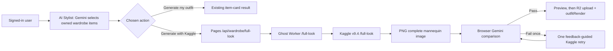

# ClothMatics Full Look — Antigravity Handoff

**Status:** deployed website integration; Kaggle v9.4 route is implemented.  
**Latest Pages release:** `ce60b3cd` — https://clothmatics.pages.dev  
**Kaggle artifact:** `kaggle/clothmatics_ghost_v9_4.ipynb` / `kaggle/clothmatics_ghost_v9_4.py`  
**Artifact SHA-256:** `43475a47512f2ab41de2d18f63671398fd78af6f2583220ae9ce33dd179fb01c`

## Goal

Give a signed-in ClothMatics user a polished, **static full-body mannequin image** of a Gemini-selected outfit. The result shows how their selected wardrobe pieces work together as a complete look.

This is AI image generation using the user's actual wardrobe references. It is **not** a rotating 3D model, recovered mesh, or virtual try-on on the user's body.

## User experience

The AI Stylist now has two deliberate entry points:

| Action | Behaviour |
| --- | --- |
| **Generate my outfit** | Existing Gemini-only stylist flow. It selects and displays wardrobe item cards. It does not contact Kaggle. |
| **Generate with Kaggle** | Runs the same Gemini selection first, then generates one complete mannequin image from that exact selected set. |

The best Gemini result also retains a **Generate outfit on Kaggle / Retry / Regenerate** control. A Kaggle failure never removes the underlying Gemini outfit selection; the user can still save, plan, or retry it.

Successful renders are saved as `outfitRender` on the saved outfit. Today’s Pick and saved-outfit views prefer this complete-look image while retaining the selected garment cards for transparent review.



## Selection rules

- The route accepts **2–6 distinct owned wardrobe items**.
- A separates look requires both a top and bottom.
- A one-piece `hero` look (for example dress, saree, lehenga, or traditional set) cannot be combined with another top/bottom.
- Layers, footwear pairs, and accessories are optional and can be included.
- Private, hidden, laundry, unavailable, or unsupported-image items are rejected before GPU work begins.
- The mannequin presentation is derived only from profile preference: `masculine`, `feminine`, or `neutral`. It must not alter garment construction.

## Quality contract

Kaggle is asked to create one coherent full-body studio mannequin image, not a collage or separate product-card layout. It must use every numbered reference exactly once and preserve:

- base and secondary colors, including multicolor region placement;
- print/graphics, fabric texture, fit, silhouette, closures, pockets, hems, and visible construction;
- footwear as a matching pair and accessories in natural positions.

It must not add, omit, duplicate, mirror, recolor, redesign, or rearrange wardrobe pieces. The display mannequin must be anonymous and non-identifiable, on a warm-white studio background.

After every generation, the browser sends the output and the selected references to the existing authenticated Gemini gateway. The verifier requires:

- one coherent complete look;
- no extra garments;
- an acceptable anonymous mannequin presentation;
- one present, color-matching, pattern-matching, construction-matching verdict for **each** selected item;
- at least `0.75` confidence for each item and the overall verdict; and
- no reported issues.

One failed comparison receives a bounded feedback-guided retry. A second failure is rejected and not persisted. This is model-based screening, not a guarantee of physically exact color, texture, or construction.

## Website implementation

### Client

- `app.js`
  - Keeps the existing `runStylist()` selection flow.
  - Adds the explicit `#stylist-standard` and `#stylist-kaggle` actions.
  - Calls `generateBestFullLook()` only for the Kaggle action or explicit result-level control.
  - Displays the generated image below the unchanged piece grid and saves it as `outfitRender`.
- `full-look.mjs`
  - `generateFullLook()` validates the selected item set, calls Pages, performs browser-side verification, and executes at most one correction retry.
  - Fetches reference images only through the authenticated same-origin wardrobe route. It prefers a previously verified garment ghost image when available.
  - Rejects malformed/non-PNG outputs, output below `640×800`, and outputs outside the size limits.
  - `fullLookImageUrl()` safely handles legacy `null`, current object, HTTPS URL, and local blob forms. This fixed the dashboard crash caused by older saved outfits with `outfitRender: null`.
- `web-api.mjs`
  - The normal AI Stylist parser accepts a single JSON object even when Gemini surrounds it with Markdown fences or commentary; it performs only bounded trailing-comma repair. Arrays and structurally invalid responses remain rejected.
- `companion.css` and `index.html`
  - Provide two visible, responsive Stylist actions; at mobile width they stack without overflow.

### Authenticated Pages proxy

`functions/api/wardrobe/full-look.js` is the only browser-facing full-look API.

`POST /api/wardrobe/full-look`

```json
{
  "wardrobeItemIds": ["item-id-1", "item-id-2"],
  "presentation": "masculine",
  "feedback": "optional bounded retry feedback"
}
```

Security and behaviour:

- Requires a Firebase bearer token and verifies it server-side.
- Reads wardrobe records constrained to the authenticated `userId`; a caller cannot supply external image URLs or another user’s item IDs.
- Downloads allowed R2/Firebase/Google Storage images server-side, with redirect, MIME, per-reference, total-reference, and output-size limits.
- Sends no Firebase identity or browser credential to Cloudflare Worker/Kaggle.
- Builds ordered multipart `reference` images plus a bounded `items` evidence manifest, `presentation`, `feedback`, random `seed`, and `contract_version=1`.
- Retries bounded GPU busy/cold-start responses, rejects redirects, and maps a missing old Kaggle route/header to `backend_upgrade_required`.
- Requires `X-Full-Look-Pipeline-Version: 1` before returning a PNG.

The Worker target is configured through the existing dashboard-managed `GHOST_MANNEQUIN_API_URL`. The proxy normalizes it to the permanent Worker’s `/full-look` path; it never accepts an arbitrary endpoint from the client.

## Kaggle v9.4 implementation

### Invariant

v9.4 adds an isolated `/full-look` endpoint only. The established `/generate` garment renderer and `/outfit` selfie/worn-photo path must remain unchanged.

### Relevant source files

- `kaggle/full_look_request_handler.py` — complete route, evidence validation, prompt packing, generation, cache, and response headers.
- `kaggle/request_handler.py` — request diagnostics recognizes `full_look`.
- `kaggle/build_notebook.py` — appends the new handler to the generated server source.
- `kaggle/notebook_runner.py` — v9.4 router startup and tunnel registration output.
- `kaggle/clothmatics_ghost_v9_4.py` and `.ipynb` — generated runnable artifacts.

### `/full-look` request contract

`POST /full-look` as multipart form data:

| Field | Type | Requirement |
| --- | --- | --- |
| `reference` | repeated image upload | 2–6 PNG/JPEG/WebP files, in the same order as `items` |
| `items` | JSON string | one bounded manifest per reference: index, slot, title/category, palette, color/finish, pattern, material, fit, construction, graphics |
| `presentation` | string | `masculine`, `feminine`, or `neutral` |
| `feedback` | string | optional bounded correction feedback |
| `contract_version` | integer | must be `1` |
| `seed` | unsigned 32-bit integer | generated server-side by Pages per user attempt |

Success response:

- `image/png`, `832×1088`.
- `X-Full-Look-Pipeline-Version: 1`.
- `X-Request-Id`, `X-Full-Look-Seed`, and generation timing headers for diagnostics.

Kaggle uses the existing warm FLUX.2 Klein pipeline, current four-step / guidance-1.0 inference configuration, shared GPU lock, and bounded ten-minute cache. It conditions on every supplied reference thumbnail and prompt evidence, then returns one image. It does not introduce another model or a mesh pipeline.

Request diagnostics are event-based and omit headers, secrets, raw images, and raw prompts. Idle output remains quiet.

## Runtime and deployment

1. Deploy the website/Pages source as usual. This publishes the client, Pages proxy, generated v9.4 artifacts, and Kaggle source endpoint.
2. Separately import or run `kaggle/clothmatics_ghost_v9_4.ipynb` in Kaggle with Internet and GPU enabled.
3. Configure the existing `CLOTHMATICS_SYNC_TOKEN` in Kaggle Secrets. Do **not** place its value in source, documentation, browser code, or logs.
4. Run the Kaggle cell. It starts the tunnel and registers the current tunnel target with the permanent Worker using `/set-target`.
5. Leave that Kaggle cell active. A new Quick Tunnel requires a fresh registration, which the notebook performs during its startup.
6. Confirm Worker health reports ready and test a signed-in complete-look request.

Pages deployment never starts, stops, or restarts Kaggle. Keep the existing Worker forwarding behaviour intact: it must pass multipart bodies and response headers through to `/full-look` as it does for `/generate` and `/outfit`.

## Validation completed

- Latest local suite: **212 Node tests passed**.
- Kaggle prompt/notebook suite: **16 Python checks passed**.
- Focused coverage includes authenticated user ownership, external URL rejection, multi-reference multipart forwarding, slot validation, old-backend detection, complete-look retry/quality rejection, legacy `outfitRender: null`, the two Stylist buttons, and bounded Gemini JSON recovery.
- Live verification after Pages release `ce60b3cd` confirmed the published application/full-look artifacts, protected Pages generation endpoints returning `401` without authentication, the v9.4 source artifact, and a ready Worker route. Kaggle was not started, stopped, or restarted by the website deployment.

## Important limitations and non-goals

- The output is a single generated image, not a live 3D viewer, cloth simulation, or virtual try-on.
- FLUX can still miss fine details; the post-generation comparison reduces bad saves but cannot prove fabric identity or real-world color under different lighting.
- At most one correction retry is intentional to bound latency, quota usage, and GPU cost.
- Do not remove the original Gemini item-card presentation. It remains the fast, dependable fallback and is intentionally separate from full-look rendering.
- Do not alter existing flat-lay single-garment `/generate` or selfie `/outfit` semantics while changing this feature.
- Never send Firebase tokens, user IDs, secret values, arbitrary source URLs, or raw private wardrobe data to Kaggle.

## Antigravity change checklist

When extending full look:

1. Update both the browser contract (`full-look.mjs`) and Pages proxy validation (`functions/api/wardrobe/full-look.js`) before changing Kaggle fields.
2. Preserve ordered references and matching `items[index]` evidence; the verifier and Kaggle depend on that order.
3. If the Kaggle response contract changes, bump and enforce `X-Full-Look-Pipeline-Version` on both Pages and Kaggle, then rebuild v9.4-style artifacts with `python kaggle/build_notebook.py`.
4. Add focused Node/Python regression coverage, run the full suites, and keep `app.js` cache busting current in `index.html`.
5. Treat a result as saveable only after the existing comparison pass. Preserve the candidate/error for user retry, but do not persist a failed render.
6. Test desktop and mobile layouts, a top+bottom outfit, a one-piece outfit, footwear/accessories, unavailable/hidden pieces, a legacy saved outfit with `outfitRender: null`, and the Gemini-only action without Kaggle available.
